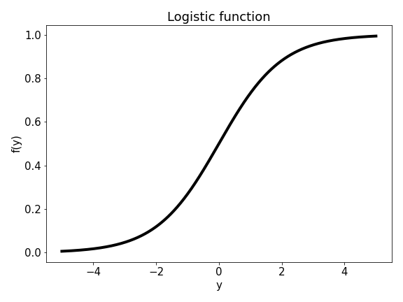
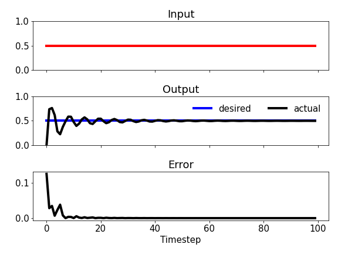

# Real-time recurrent learning (1989)

## Real-time recurrent learning for continuous online learning.

### Table of Contents

- [Images](#images)
- [Description](#description)
- [Keywords](#keywords)
- [How to Use](#how-to-use)
- [References](#references)
- [Author Info](#author-info)

## Images

## Description

"Real-time recurrent learning for continuous online learning."

#### Technologies

- Python programming language

## Keywords

 - Recurrent neural network
 - Online learning
 - Supervised learning
 - Logistic activation function
 - Connection weight matrix
 - Gradient descent
 - Partial derivatives

## How to Use

#### Getting started

`git clone https://github.com/berberianareg/Real-time-recurrent-learning.git`

#### Dependencies

see requirements.txt

#### Installation

`pip install numpy`

`pip install matplotlib`

#### Executing the program from command line

`python RTRL.py`

## References

#### Links

- Relevant paper - (https://ieeexplore.ieee.org/document/6795228)

## Author Info

- Twitter - [@berberianareg](https://twitter.com/BerberianNareg)
- LinkedIn - [Nareg Berberian](https://www.linkedin.com/in/nareg-berberian-phd-ab6759b9/)

[Back to the Top](#real-time-recurrent-learning-1989)

